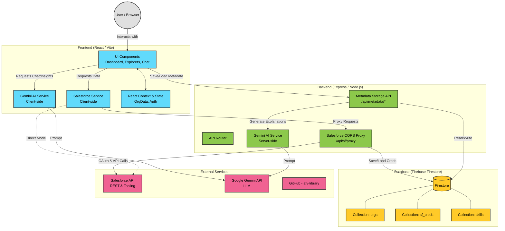

# Metaassist - Architecture Overview

This document outlines the architecture of the Metaassist application, a full-stack tool designed to analyze, document, and interact with Salesforce metadata using AI.

## High-Level Architecture Diagram

## Component Breakdown

### 1. Frontend (React + Vite + Tailwind CSS)
The frontend is a Single Page Application (SPA) that provides the user interface for interacting with Salesforce metadata.
*   **UI Components:** Modular components like `ObjectExplorer`, `MetadataHub`, `Dashboard`, and `AIChatBot`.
*   **SalesforceService (`/services/salesforceService.ts`):** Handles communication with Salesforce. It routes requests through the backend proxy to avoid CORS issues, or directly to Salesforce if "Direct Mode" is enabled.
*   **GeminiService (`/services/geminiService.ts`):** Handles communication with the Google Gemini API for generating code suggestions, chat responses, and architecture audits.

### 2. Backend (Express + Node.js)
The backend serves as a secure proxy and data management layer.
*   **Salesforce Proxy (`/api/sf/proxy`):** Bypasses browser CORS restrictions by forwarding requests from the frontend to Salesforce. It also securely injects stored credentials when necessary.
*   **Metadata Storage API (`/api/metadata/*`):** Handles the chunking, saving, and retrieving of large Salesforce metadata payloads to/from Firestore.
*   **Server-side AI Generation:** When metadata is fetched from the database and lacks an explanation, the backend automatically calls Gemini to generate documentation and Mermaid diagrams before returning the data to the client.

### 3. Database (Firebase Firestore)
A NoSQL document database used for persistence.
*   **`sf_creds` Collection:** Securely stores encrypted/hashed Salesforce OAuth credentials (Client ID, Client Secret) keyed by username.
*   **`skills` Collection:** Stores agent skills and instructions imported from the `forcedotcom/afv-library`. These are used to ground Gemini's analysis in Salesforce best practices.
*   **`orgs` Collection:** Stores metadata for each connected Salesforce Org.
    *   **`metadata` Subcollection:** Stores the actual retrieved metadata components (Objects, Classes, Flows, etc.). Large files are split into chunks to bypass Firestore's 1MB document limit.

### 4. External Services
*   **Salesforce API:** The source of truth for all metadata. The app uses both the standard REST API and the Tooling API (for detailed field definitions, dependencies, etc.).
*   **Google Gemini API:** Powers the AI features, including automated documentation, code review, architectural insights, and the interactive chatbot.
